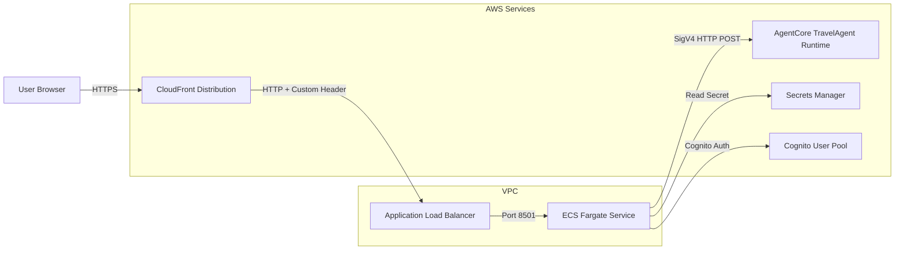

# Design Document: Deploy Streamlit App

## Overview

This feature creates a production deployment of the Travel Planner Streamlit application as a containerized service on AWS ECS Fargate. The deployment wraps the existing local Streamlit app (`streamlit_app/`) with Cognito-based authentication, packages it in a Docker container, and provisions all required AWS infrastructure via a standalone Python CDK project.

The deliverable is a new `deploy-streamlit-app/` directory at the project root containing:
- `docker_app/` — The containerized Streamlit application (flat module structure)
- `cdk/` — CDK stack module
- `app.py` — CDK entry point
- `cdk.json`, `requirements.txt` — CDK project configuration

This is a **separate CDK project** from the existing `agentcore/cdk/` TypeScript stack. It uses Python CDK and is deployed independently with `cdk deploy`.

### Key Design Decisions

1. **Flat module structure** in `docker_app/`: `app.py`, `cognito_client.py`, `agent_client.py`, `config_file.py` — no `utils/` subdirectory
2. **No `docker-compose.yml`** — it has no effect in the CDK deployment pipeline
3. **SigV4-signed HTTP POST** via `botocore.auth.SigV4Auth` with service name `bedrock-agentcore` — not using boto3 SDK methods directly
4. **`TRAVEL_AGENT_URL`** passed as a container environment variable from CDK context
5. **`bedrock-agentcore:InvokeRuntime`** IAM permission on the task role (not `bedrock:InvokeModel`)
6. **Descriptive resource naming** — `STACK_NAME = "TravelPlanner"` with `-agent-ui` suffix for controllable resources (ALB, ECS service, VPC, security groups, target group)

## Architecture



**Request flow:**
1. User accesses the CloudFront URL (HTTPS)
2. CloudFront forwards to ALB with a custom header (`X-Custom-Header`) for origin validation
3. ALB validates the custom header and routes to the ECS Fargate service on port 8501
4. Streamlit app authenticates the user via Cognito (parameters fetched from Secrets Manager)
5. Authenticated user submits chat prompts, which are sent to the TravelAgent runtime via SigV4-signed HTTP POST

## Components and Interfaces

### 1. `docker_app/config_file.py` — Configuration Module

Centralized configuration shared by both the Docker app and the CDK stack.

```python
class Config:
    STACK_NAME: str              # "TravelPlanner"
    CUSTOM_HEADER_VALUE: str     # Random string for ALB-CloudFront validation
    SECRETS_MANAGER_ID: str      # Derived from STACK_NAME
    DEPLOYMENT_REGION: str       # e.g. "us-east-1"
```

**Resource naming convention:** `STACK_NAME = "TravelPlanner"` with `-agent-ui` suffix for controllable resources:
- ALB: `TravelPlanner-agent-ui`
- ECS Service: `TravelPlanner-agent-ui`
- VPC: `TravelPlanner-agent-ui-vpc`
- ALB Security Group: `TravelPlanner-agent-ui-alb-sg`
- ECS Security Group: `TravelPlanner-agent-ui-ecs-sg`
- Target Group: `TravelPlanner-agent-ui-tg`

- Imported by `docker_app/app.py` (runtime) and `cdk/cdk_stack.py` (deploy time)
- `SECRETS_MANAGER_ID` is derived from `STACK_NAME` to maintain naming consistency

### 2. `docker_app/cognito_client.py` — Cognito Authentication

Provides `get_authenticator(secret_id, region)` that:
1. Reads Cognito parameters (pool_id, app_client_id, app_client_secret) from Secrets Manager
2. Returns a configured `CognitoAuthenticator` instance from `streamlit-cognito-auth`

**Interface:**
```python
def get_authenticator(secret_id: str, region: str) -> CognitoAuthenticator
```

### 3. `docker_app/agent_client.py` — TravelAgent HTTP Client

Adapted from the existing `streamlit_app/agent_client.py`. Sends SigV4-signed HTTP POST requests to the TravelAgent runtime.

**Interface:**
```python
TRAVEL_AGENT_URL: str  # From os.environ

def get_config_errors() -> list[str]
    # Returns list of missing required env var names

def invoke(prompt: str) -> str
    # Sends prompt to TravelAgent, returns response text
    # Raises RuntimeError on non-200 or network errors
```

- Signs requests with `SigV4Auth(credentials, "bedrock-agentcore", region)`
- Uses `httpx` for the HTTP POST
- Reads `TRAVEL_AGENT_URL` from environment variable (set by CDK)

### 4. `docker_app/app.py` — Streamlit Entry Point

Thin entry point that wires together authentication and the chat interface.

**Flow:**
1. Initialize `CognitoAuthenticator` via `cognito_client.get_authenticator()`
2. Call `authenticator.login()` — if not authenticated, `st.stop()`
3. Check `agent_client.get_config_errors()` — if missing config, show error and `st.stop()`
4. Render sidebar with username and logout button
5. Render chat interface (message history + input)
6. On user input, call `agent_client.invoke(prompt)` and display response
7. On error, display error message via `st.error()`

### 5. `docker_app/Dockerfile`

```dockerfile
FROM --platform=linux/amd64 python:3.12
EXPOSE 8501
WORKDIR /app
COPY requirements.txt ./requirements.txt
RUN pip3 install --upgrade pip && pip3 install -r requirements.txt
COPY . .
CMD streamlit run app.py
```

### 6. `docker_app/requirements.txt`

```
boto3
httpx
streamlit
streamlit-cognito-auth
```

### 7. `cdk/cdk_stack.py` — CDK Infrastructure Stack

Provisions all AWS resources. Follows the reference implementation pattern with these adaptations:

**Resources created:**
- **Cognito User Pool** + **User Pool Client** (with generated secret)
- **Secrets Manager Secret** storing Cognito parameters (pool_id, app_client_id, app_client_secret)
- **VPC** (2 AZs, 1 NAT gateway)
- **Security Groups** (ALB SG: inbound 80; ECS SG: inbound 8501 from ALB SG only)
- **ECS Cluster** (Fargate capacity providers)
- **Fargate Task Definition** (512 MiB memory, 256 CPU)
- **Container** built from `docker_app/` with port 8501, `TRAVEL_AGENT_URL` env var
- **Fargate Service** in private subnets
- **ALB** (internet-facing, public subnets)
- **ALB Listener** with custom header condition routing to ECS, default 403
- **CloudFront Distribution** (HTTPS redirect, all methods, no cache, custom header injection)
- **IAM Policy** granting `bedrock-agentcore:InvokeAgentRuntime` on `*`
- **Secrets Manager read** grant to task role

**Key difference from reference:** The IAM policy grants `bedrock-agentcore:InvokeRuntime` instead of `bedrock:InvokeModel`, because the container communicates with the TravelAgent via AgentCore runtime, not Bedrock directly.

**`TRAVEL_AGENT_URL` injection:** The CDK stack reads the TravelAgent URL from CDK context (`self.node.try_get_context("travel_agent_url")`) or falls back to an environment variable, and passes it as a container environment variable.

**Outputs:**
- `CloudFrontDistributionURL` — the CloudFront domain name
- `CognitoPoolId` — the Cognito User Pool ID

### 8. `app.py` — CDK Entry Point

```python
import aws_cdk as cdk
from cdk.cdk_stack import CdkStack
from docker_app.config_file import Config

app = cdk.App()
CdkStack(app, Config.STACK_NAME, env=cdk.Environment(region=Config.DEPLOYMENT_REGION))
app.synth()
```

### 9. `cdk.json` — CDK Configuration

Standard CDK configuration with `"app": "python3 app.py"` and recommended feature flags.

### 10. `requirements.txt` — CDK Dependencies

```
aws-cdk-lib>=2.160.0
constructs>=10.0.0
```

### 11. README.md Updates

A new "Deploy Streamlit App" section added to the project README with:
- Prerequisites (Docker, AWS CDK, Python, AWS credentials)
- Step-by-step deployment instructions
- How to create a Cognito user
- How to access the deployed app via CloudFront URL

## Data Models

### Secrets Manager Secret Structure

```json
{
  "pool_id": "<cognito-user-pool-id>",
  "app_client_id": "<cognito-client-id>",
  "app_client_secret": "<cognito-client-secret>"
}
```

### Agent Client Request/Response

**Request** (HTTP POST to `TRAVEL_AGENT_URL`):
```json
{
  "prompt": "<user message>"
}
```

**Response** (200 OK):
```json
{
  "response": "<agent reply text>"
}
```

### Streamlit Session State

```python
st.session_state.messages: list[dict]
# Each dict: {"role": "user" | "assistant", "content": "<text>"}
```

## Error Handling

| Scenario | Handling |
|---|---|
| `TRAVEL_AGENT_URL` not set | `agent_client.get_config_errors()` returns the missing var name; `app.py` shows `st.error()` and calls `st.stop()` |
| Agent returns non-200 | `agent_client.invoke()` raises `RuntimeError`; `app.py` catches and displays via `st.error()` |
| Network error (httpx) | `agent_client.invoke()` raises `RuntimeError`; `app.py` catches and displays via `st.error()` |
| User not authenticated | `authenticator.login()` returns `False`; `app.py` calls `st.stop()` showing only the login form |
| Secrets Manager read fails | `cognito_client.get_authenticator()` raises boto3 exception; Streamlit shows unhandled error page |
| ALB request without custom header | ALB listener default action returns HTTP 403 "Access denied" |

## Testing Strategy

### Why Property-Based Testing Does Not Apply

This feature is primarily **Infrastructure as Code** (CDK stack provisioning) and **UI wiring** (Streamlit + Cognito auth + HTTP client). There are no pure functions with large input spaces or universal properties that would benefit from property-based testing:

- The CDK stack is declarative infrastructure — best validated with **CDK assertions / snapshot tests**
- The Streamlit UI is rendering and interaction logic — best validated with **manual testing**
- The `agent_client` module is a thin HTTP wrapper around external services — best validated with **mock-based unit tests**
- The `config_file` module is static configuration — best validated with **example-based tests**

### Recommended Testing Approach

**1. CDK Stack Assertions (Unit Tests)**
- Verify the synthesized CloudFormation template contains expected resources
- Assert Cognito User Pool and Client are created
- Assert Secrets Manager secret is created with correct name
- Assert VPC, ALB, ECS cluster, Fargate service are provisioned
- Assert IAM policy grants `bedrock-agentcore:InvokeRuntime`
- Assert CloudFront distribution is configured correctly
- Assert ALB listener has custom header condition and default 403 action
- Assert `TRAVEL_AGENT_URL` is passed as container environment variable

**2. Docker Build Verification (Smoke Test)**
- `docker build` succeeds from `docker_app/` directory
- Container starts and Streamlit binds to port 8501

**3. Manual Integration Testing**
- Deploy stack, create Cognito user, access CloudFront URL
- Verify login flow, chat interaction, logout
- Verify direct ALB access (without custom header) returns 403
