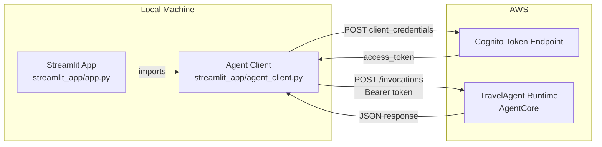

# Design Document: Streamlit Travel Planner App

## Overview

This design describes a lightweight Streamlit chat application that runs locally and communicates with the TravelAgent runtime deployed on AgentCore. The app provides a chat-style UI using Streamlit's native `st.chat_message` and `st.chat_input` components, sends user prompts to the TravelAgent via HTTP POST, and displays the agent's responses.

The app authenticates to the TravelAgent runtime endpoint using OAuth2 `client_credentials` flow, following the same pattern used by `travel_agent/agent.py` to authenticate against the AgentCore Gateway. There is no user-facing authentication (no Cognito login screen) — the OAuth2 flow is purely machine-to-machine for API access.

### Key Design Decisions

1. **Two-file architecture**: `app.py` handles all Streamlit UI concerns; `agent_client.py` encapsulates HTTP communication and OAuth2 token management. This keeps the UI layer free of auth/networking logic.
2. **httpx over requests**: Consistent with the existing `travel_agent/agent.py` codebase. httpx is already a project dependency.
3. **Module-level token cache**: Mirrors the `_token_cache` pattern in `travel_agent/agent.py`. Since Streamlit reruns the script on every interaction but preserves module-level state within a server process, this avoids redundant token fetches.
4. **No session_id/user_id forwarding**: The Streamlit app sends only `{"prompt": "..."}` to the TravelAgent runtime. The runtime's `invoke` entrypoint extracts session/user from its own `context` parameter, which is managed by AgentCore — not by the client.
5. **Environment variables for all secrets**: No hardcoded credentials in source. All OAuth2 and endpoint configuration comes from environment variables, matching the `os.environ.get()` pattern used throughout the project.

## Architecture



### Request Flow

1. User types a message in `st.chat_input`
2. `app.py` appends the user message to `st.session_state.messages` and displays it
3. `app.py` calls `agent_client.invoke(prompt)` inside a `st.spinner`
4. `agent_client.invoke()` calls `_get_token()` which returns a cached token or fetches a new one via OAuth2 `client_credentials`
5. `agent_client.invoke()` sends `POST` to `TRAVEL_AGENT_URL` with `{"prompt": prompt}` and `Authorization: Bearer <token>`
6. On success, returns the `response` field from the JSON body
7. `app.py` appends the assistant message to session state and displays it

## Components and Interfaces

### `streamlit_app/app.py` — UI Entry Point

Responsibilities:
- Page configuration (`st.set_page_config`, `st.title`)
- Sidebar with "Clear Chat" button and description text
- Environment variable validation on startup
- Chat history rendering from `st.session_state.messages`
- Chat input handling via `st.chat_input`
- Calling `agent_client.invoke()` and displaying results or errors

Key Streamlit APIs used:
- `st.set_page_config(page_title="Travel Planner Agent")`
- `st.title("Travel Planner Agent")`
- `st.chat_message(role)` — renders user/assistant bubbles
- `st.chat_input(placeholder)` — bottom-anchored text input
- `st.session_state` — persists `messages` list across reruns
- `st.sidebar` — sidebar container
- `st.spinner("Thinking...")` — loading indicator
- `st.error()` — error display

```python
# app.py interface sketch
import streamlit as st
from agent_client import invoke, get_config_errors

def main():
    st.set_page_config(page_title="Travel Planner Agent")
    st.title("Travel Planner Agent")

    # Validate config
    errors = get_config_errors()
    if errors:
        st.error(f"Missing environment variables: {', '.join(errors)}")
        st.stop()

    # Sidebar
    with st.sidebar:
        st.markdown("Connects to the TravelAgent on AgentCore.")
        if st.button("Clear Chat"):
            st.session_state.messages = []
            st.rerun()

    # Init chat history
    if "messages" not in st.session_state:
        st.session_state.messages = []

    # Render history
    for msg in st.session_state.messages:
        with st.chat_message(msg["role"]):
            st.markdown(msg["content"])

    # Handle input
    if prompt := st.chat_input("Ask the travel planner..."):
        st.session_state.messages.append({"role": "user", "content": prompt})
        with st.chat_message("user"):
            st.markdown(prompt)

        with st.chat_message("assistant"):
            with st.spinner("Thinking..."):
                try:
                    response = invoke(prompt)
                    st.markdown(response)
                    st.session_state.messages.append({"role": "assistant", "content": response})
                except Exception as e:
                    st.error(str(e))
```

### `streamlit_app/agent_client.py` — HTTP/OAuth2 Client

Responsibilities:
- Read configuration from environment variables
- Validate that required environment variables are present
- Manage OAuth2 token lifecycle (fetch, cache, refresh before expiry)
- Send HTTP POST to TravelAgent runtime with bearer token
- Return response text or raise descriptive errors

```python
# agent_client.py interface sketch
import os
import httpx
from datetime import datetime

TRAVEL_AGENT_URL = os.environ.get("TRAVEL_AGENT_URL", "")
TRAVEL_AGENT_CLIENT_ID = os.environ.get("TRAVEL_AGENT_CLIENT_ID", "")
TRAVEL_AGENT_CLIENT_SECRET = os.environ.get("TRAVEL_AGENT_CLIENT_SECRET", "")
TRAVEL_AGENT_TOKEN_ENDPOINT = os.environ.get("TRAVEL_AGENT_TOKEN_ENDPOINT", "")
TRAVEL_AGENT_SCOPE = os.environ.get("TRAVEL_AGENT_SCOPE", "")

_REQUIRED_VARS = [
    "TRAVEL_AGENT_URL",
    "TRAVEL_AGENT_CLIENT_ID",
    "TRAVEL_AGENT_CLIENT_SECRET",
    "TRAVEL_AGENT_TOKEN_ENDPOINT",
]

_token_cache: dict = {"token": None, "expires_at": 0.0}


def get_config_errors() -> list[str]:
    """Return list of missing required environment variable names."""
    ...

def _get_token() -> str:
    """Return a valid OAuth2 access token, refreshing if needed."""
    ...

def invoke(prompt: str) -> str:
    """Send prompt to TravelAgent and return the response text."""
    ...
```

#### `get_config_errors() -> list[str]`
Returns names of any required environment variables that are missing or empty. Called by `app.py` at startup.

#### `_get_token() -> str`
- Checks `_token_cache["expires_at"]` against current time
- If token is valid (more than 5 minutes until expiry), returns cached token
- Otherwise, POSTs to `TRAVEL_AGENT_TOKEN_ENDPOINT` with `grant_type=client_credentials`, `scope=TRAVEL_AGENT_SCOPE`, using HTTP Basic Auth (`client_id:client_secret`)
- On success: caches `access_token` and sets `expires_at = now + expires_in - 300`
- On failure: raises `RuntimeError` with status code and response body

#### `invoke(prompt: str) -> str`
- Calls `_get_token()` to get a bearer token
- POSTs to `TRAVEL_AGENT_URL` with JSON body `{"prompt": prompt}` and headers `Authorization: Bearer <token>`, `Content-Type: application/json`
- On 200: returns `response` field from JSON body
- On non-200: raises `RuntimeError` with status code and response text
- On network error (`httpx.HTTPError`): raises `RuntimeError` describing connection failure

## Data Models

### Chat Message (in `st.session_state.messages`)

```python
# Each message in the list:
{"role": "user" | "assistant", "content": str}
```

A simple list of dicts stored in `st.session_state.messages`. Initialized as `[]` on first load. Cleared to `[]` when "Clear Chat" is clicked.

### Token Cache (module-level in `agent_client.py`)

```python
_token_cache: dict = {
    "token": str | None,      # The OAuth2 access token
    "expires_at": float,       # Unix timestamp when token should be refreshed
}
```

### TravelAgent Request

```python
# POST body to TRAVEL_AGENT_URL
{"prompt": str}
```

### TravelAgent Response

```python
# 200 response body from TravelAgent runtime
{"response": str}
```

### OAuth2 Token Request

```
POST {TRAVEL_AGENT_TOKEN_ENDPOINT}
Content-Type: application/x-www-form-urlencoded
Authorization: Basic base64(client_id:client_secret)

grant_type=client_credentials&scope={TRAVEL_AGENT_SCOPE}
```

### OAuth2 Token Response

```json
{
  "access_token": "string",
  "expires_in": 3600,
  "token_type": "Bearer"
}
```


## Correctness Properties

*A property is a characteristic or behavior that should hold true across all valid executions of a system — essentially, a formal statement about what the system should do. Properties serve as the bridge between human-readable specifications and machine-verifiable correctness guarantees.*

### Property 1: Missing environment variables are correctly identified

*For any* subset of the four required environment variables (`TRAVEL_AGENT_URL`, `TRAVEL_AGENT_CLIENT_ID`, `TRAVEL_AGENT_CLIENT_SECRET`, `TRAVEL_AGENT_TOKEN_ENDPOINT`), `get_config_errors()` should return exactly the names of the variables not present in that subset.

**Validates: Requirements 2.6**

### Property 2: Token cache returns cached token when valid, refreshes when expired

*For any* cached token with an `expires_at` timestamp, calling `_get_token()` at a time before `expires_at` should return the cached token without making an HTTP request, and calling `_get_token()` at a time at or after `expires_at` should fetch a new token from the token endpoint.

**Validates: Requirements 3.2, 3.3**

### Property 3: Token endpoint errors include status code and response body

*For any* non-200 HTTP status code (400–599) and *any* response body string, when the token endpoint returns that status and body, `_get_token()` should raise an error whose message contains both the numeric status code and the response body text.

**Validates: Requirements 3.4**

### Property 4: Messages are correctly appended to chat history

*For any* role ("user" or "assistant") and *any* non-empty content string, appending a message to `st.session_state.messages` should result in the last element being `{"role": role, "content": content}` and the list length increasing by one.

**Validates: Requirements 4.4, 4.6**

### Property 5: Invoke sends prompt in correct request format

*For any* non-empty string prompt, `invoke(prompt)` should send an HTTP POST with a JSON body where the `prompt` field equals the input string exactly.

**Validates: Requirements 5.1**

### Property 6: Invoke extracts response field from successful agent reply

*For any* string value, when the TravelAgent runtime returns a 200 response with JSON body `{"response": value}`, `invoke()` should return that exact string value.

**Validates: Requirements 5.4**

### Property 7: Agent runtime errors include status code and response text

*For any* non-200 HTTP status code and *any* response body string, when the TravelAgent runtime returns that status and body, `invoke()` should raise an error whose message contains both the numeric status code and the response body text.

**Validates: Requirements 5.5**

## Error Handling

### Configuration Errors (Startup)

| Condition | Behavior |
|---|---|
| One or more required env vars missing | `st.error()` displays which variables are missing, `st.stop()` halts the app |
| `TRAVEL_AGENT_SCOPE` missing | Allowed — scope is optional, token request omits the `scope` parameter |

### OAuth2 Token Errors

| Condition | Behavior |
|---|---|
| Token endpoint returns non-200 | `RuntimeError` raised with status code and response body; displayed via `st.error()` in chat |
| Token endpoint unreachable (network error) | `httpx.HTTPError` caught, re-raised as `RuntimeError` with connection failure description |
| Token response missing `access_token` field | `KeyError` propagated, displayed as error in chat |

### TravelAgent Invocation Errors

| Condition | Behavior |
|---|---|
| Runtime returns non-200 | `RuntimeError` raised with status code and response text; displayed via `st.error()` in chat |
| Runtime unreachable (network error) | `httpx.HTTPError` caught, re-raised as `RuntimeError` describing connection failure |
| Response JSON missing `response` field | `KeyError` propagated, displayed as error in chat |

### UI Error Display

All errors during invocation are caught in `app.py`'s input handler and displayed using `st.error(str(e))` within the assistant's chat message container. The error does not crash the app — the user can continue sending messages.

## Testing Strategy

### Unit Tests (pytest)

Unit tests cover specific examples, edge cases, and integration points:

- **Config validation**: Verify `get_config_errors()` returns correct missing var names for specific combinations (all present, all missing, one missing)
- **Token fetch**: Mock `httpx.post`, verify request format (grant_type, scope, auth header)
- **Token caching**: Mock time, verify cached token is reused and expired token triggers refresh
- **Invoke success**: Mock `httpx.post` for both token and agent endpoints, verify response extraction
- **Invoke errors**: Mock non-200 responses, verify error messages contain status and body
- **Network errors**: Mock `httpx.HTTPError`, verify connection failure message
- **Clear chat**: Verify `st.session_state.messages` is emptied

### Property-Based Tests (Hypothesis)

Property-based tests verify universal properties across generated inputs. Each test runs a minimum of 100 iterations.

Library: **Hypothesis** (Python's standard PBT library)

| Property | Test Description | Tag |
|---|---|---|
| Property 1 | Generate random subsets of required env var names, verify `get_config_errors()` returns the complement | Feature: streamlit-app, Property 1: Missing environment variables are correctly identified |
| Property 2 | Generate random `expires_in` values and call times, verify cache hit/miss behavior | Feature: streamlit-app, Property 2: Token cache returns cached token when valid, refreshes when expired |
| Property 3 | Generate random non-200 status codes and response body strings, verify error contains both | Feature: streamlit-app, Property 3: Token endpoint errors include status code and response body |
| Property 4 | Generate random role/content pairs, verify append behavior | Feature: streamlit-app, Property 4: Messages are correctly appended to chat history |
| Property 5 | Generate random prompt strings, mock HTTP, verify POST body contains exact prompt | Feature: streamlit-app, Property 5: Invoke sends prompt in correct request format |
| Property 6 | Generate random response strings, mock 200 response, verify return value matches | Feature: streamlit-app, Property 6: Invoke extracts response field from successful agent reply |
| Property 7 | Generate random non-200 status codes and body strings, verify error contains both | Feature: streamlit-app, Property 7: Agent runtime errors include status code and response text |

### Test Configuration

- Framework: pytest
- PBT library: Hypothesis
- Mocking: `unittest.mock.patch` for `httpx.post` and environment variables
- Minimum PBT iterations: 100 per property (`@settings(max_examples=100)`)
- Test location: `tests/test_agent_client.py`
